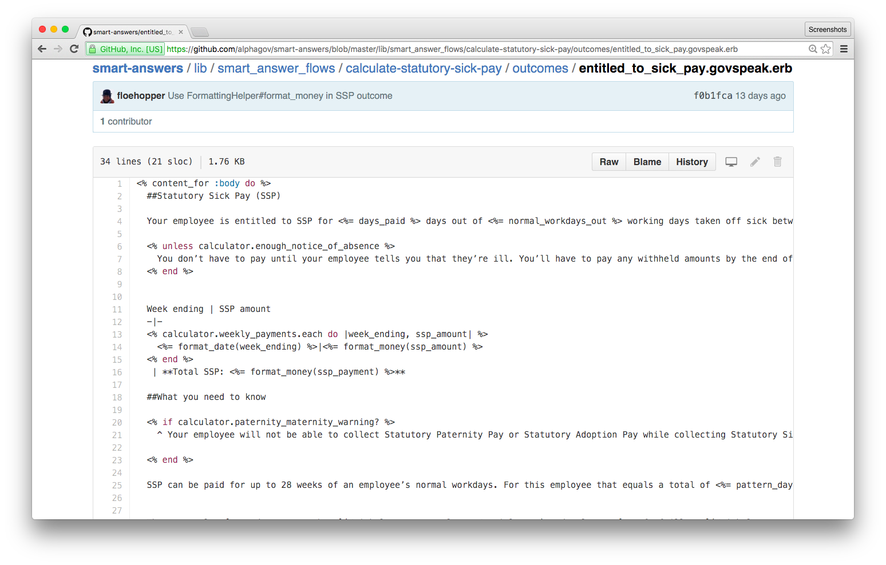

# Smart Answers

^
* CJR
* Can we save questions to the end, please?

---

# Who are we?

---

# James Mead & Chris Roos

---


---

# What are we going to talk about?

* What were we asked to do?
* What did we decide to do?
* What have we done?
* What would we do next?
* Conclusion

---

# What were we asked to do?

* Reduce maintenance cost of Smart Answers
  * Developer time
  * Content Team time
* Ideally end up with a system that makes it easy for Content Team to edit content

---

# What did we decide to do?

* Reduce developer maintenance cost
* No new Smart Answer format
* Reduce number of implementations
* Improve Ruby Smart Answers

^
* Reduce developer maintenance cost
  * We think there's going to be developer involvement for quite some time and it felt like improving the experience would be most beneficial
* No new Smart Answer format
  * Big bang approach - have to be feature complete before we can migrate all existing Smart Answers to it
* Reduce number of implementations
  * Maintenance overhead of having 4 ways to do the same thing
  * We think it’s better to rationalise the four existing implementations into one and then iteratively improve that
* Improve Ruby Smart Answers
  * Majority of existing Smart Answers are already in this format
  * Better separation of concerns e.g. presentation logic, flow logic & policy logic all mixed up together
    * This problem wasn't unique to Ruby Smart Answers
  * Include some of the features of Smartdown that we liked
  * ADR001 explains why we chose Ruby over Smartdown

---

# What have we done?

^
* JEM

---

## Removed Smartdown

^
* No multiple questions per page - not obvious that we'll want to add it back

---

## Domain modelling

^
* TaxYear (5th/6th April mentioned in a number of places)
* "Calculate your employee's statutory sick pay"
  * Period of Incapacity for Work (PIW) not explicitly modeled
  * When linked period of sickness functionality added, unnecessary duplicate logic added
* We've only done this in a few places

---

## Improved Factcheck process

^
* Deploy to Heroku

---

## ERB templates

```
vat-payment-deadlines
├── vat_payment_deadlines.govspeak.erb
├── questions
│   ├── how_do_you_want_to_pay.govspeak.erb
│   └── when_does_your_vat_accounting_period_end.govspeak.erb
└── outcomes
    ├── result_bacs_direct_credit.govspeak.erb
    ├── result_bank_giro.govspeak.erb
    ├── result_chaps.govspeak.erb
    ├── result_cheque.govspeak.erb
    ├── result_direct_debit.govspeak.erb
    ├── result_online_debit_credit_card.govspeak.erb
    └── result_online_telephone_banking.govspeak.erb
```

^
* Directory structure
* This is very similar to the structure of Smartdown

---



^
* ERB tags for logic, loops and partials
* Possible to edit these using the GitHub web interface - some of you have already done that

---

## New HMRC Smart Answer

^
* HMRC's "Calculate your part-year profits to finalise your tax credits"
* Visualisation to help illustrate/describe how the various dates interacted
* Highlighted some of the pain with the current process
* Logic doc contained the rules but not necessarily the reasons behind them
* Started with a simple scenario and then enhanced it to support more complicated scenarios
* New testing approaches that we think are better and have allowed us to avoid adding regression tests for this Smart Answer
* First time we applied our ideas about separating concerns and domain modelling.

---

# What would we do next?

^
* CJR

---

## Improve FCO Smart Answers

^
* Sorry!
* These are some of the most painful Smart Answers due to the number of countries/territories and the frequency of changes to the rules
* Reorganize templates & partials e.g. investigate country-specific outcome pages

---

## Process improvements

^
* Smart Answers aren’t just content - each one is a little app
* Earlier developer involvement
* Process is very waterfally
  * Logic docs
    * Up front design
    * Misses the “why” behind the rules
  * Anything we can do to make it more incremental/iterative would be an improvement
    * Sit/work closely with policy people in the department?
* Build a very simple version of a new Smart Answer
   * Handle a single happy path
   * Describes the cases it doesn’t handle
   * Get it deployed and get feedback
   * Incrementally cover more scenarios
   * Easier for a developer to understand if built incrementally rather than trying to understand the entire flow in one go

---

## Improve workflow for Content Team

^
* Currently:
  * Content editor uses GitHub to fork Smart Answers and change ERB templates
  * Opens PR from forked repo
  * We regenerate regression test artefacts and open new PR
  * We deploy the changes to Heroku for fact check
* We can imagine streamlining this process

---

## User interface for editing data

^
* Particularly for data that changes relatively frequently, e.g. rates, fees, properties of countries

---

# Conclusion

^
* JEM

---

## Recap: What we were asked to do

* Reduce maintenance cost of Smart Answers
  * Developer time
  * Content Team time
* Ideally end up with a system that makes it easy for Content Team to edit content

^
* Mostly focussed on reducing the amount of developer time required to maintain Smart Answers
* Hopefully that has a knock on benefit to the Content Team
* Although we've made progress towards it, a publishing workflow for Smart Answers is still some way off
* If you have any questions after we've gone then please do get in touch - we're keen to see this project succeed

---

## Pub?

^
* We'll be at the Princess Louise from 5:30pm

---

## Questions?
