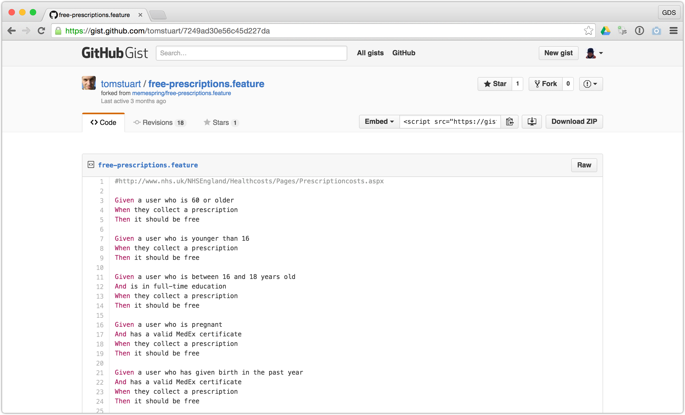

# Smart Answers

^
* CJR
* Can we save questions to the end, please?

---

# Who are we?

---

# James Mead & Chris Roos

## @floehopper & @chrisroos

---

---

# What are we going to talk about?

* What are Smart Answers?
* What were we asked to do?
* How did we approach the problem?
* What did we decide to do?
* What have we done?
* What would we do next?
* Conclusion

---

# [fit] What are Smart Answers?

^
* JEM
* Quote from Lisa Scott's blog post - https://gds.blog.gov.uk/2012/02/16/smart-answers-are-smart/
* "Smart answers are a great tool for content designers to present complex information in a quick and simple way. Defining what they are [...] is immaterial - what they do is provide a reusable technical framework to build a quick and simple answer to a complex question."

---

## What do they look like?

^
* Smart Answers are made up of three types of pages:
  * Landing page
  * Question pages
  * Outcome pages

---

## Landing page

---

^
* Includes the title of the Smart Answer, some information about what it's going to help you with, and a "Start now" button.
* This Smart Answer lets a landlord know whether they need to check that a tenant can legally rent their residential property.

---

## Question page

---

^
* Includes a _single_ question
* Question types:
  * Multiple choice
  * Checkbox
  * Country
  * Date
  * Money
  * Salary (weekly, monthly or annual periods)
  * Postcode
  * Value - numbers and text

---

## Outcome page

---

^
* Displays the answer to the question that this Smart Answer is helping you with.
* In this case we can see that the landlord doesn't need to check whether a tenant can legally rent their residential property.

---

# [fit] What were we asked to do?

---

## Goals

* Reduce maintenance cost of Smart Answers
  * Developer time
  * Content Team time
* Ideally end up with a system that makes it easy for Content Team to edit content

---

# [fit] How did we approach the problem?

^
* CJR

---

## Implementations

* Simple Smart Answers
* Calculators
* Smartdown Smart Answers
* Ruby Smart Answers
* New Smart Answer format?

^
* We investigated the four ways of building Smart Answers
* We considered building a new all-encompassing Smart Answer format

---

## Simple Smart Answers

---

## Simple Smart Answers

### Overview

* Created in Publisher
* Read from Content API
* Rendered by Frontend

^
* Created in Publisher
  * Written to MongoDB via govuk_content_models
* Read from Content API
  * Frontend reads from MongoDB via gds-api-adapters & govuk_content_api
* Rendered by Frontend
  * Frontend processes responses and renders question/outcome pages

---

## Simple Smart Answers

### Advantages

* Familiar publishing workflow for content editors
* No developer involvement required

^
* Uses the same tools and workflow that content editors use to publish other content
* Content editors can create and maintain Simple Smart Answers without any developer involvement

---

## Simple Smart Answers

### Disadvantages

* Very limited functionality
* Hard to maintain
* Implementation spread over multiple apps/libs
* Complex code in Publisher
* UI divergence in Frontend

^
* Very limited functionality
  * Only decision trees
  * Routing can only depend on latest response
  * No calculations
  * No country questions
* Hard to maintain
  * E.g. Re-ordering questions is very painful
* Implementation spread over multiple apps/libs
  * publisher -> govuk_content_models -> mongodb
    * SimpleSmartAnswerEdition, SSAE::Node, SSAE::Node::Option
  * frontend <- gds-api-adapters <- govuk_content_api <- mongodb
    * SimpleSmartAnswersController
    * SimpleSmartAnswers::Flow, SSA::Node, SSA::State
* Complex code in Publisher
  * Single EditionsController for all formats (inherited_resources)
  * Combination of nested_form (forked), formtastic-bootstrap, formtastic & custom JS
  * No unit tests for JS, only integration tests (capybara/poltergeist/phantomjs)
* UI divergence
  * Looks similar, but not identical, to other Smart Answers

---

## Calculators

---

## Calculators

### Overview

* Child Benefit tax calculator
* Separate Rails app
* All questions on a single page
* Dynamic number of questions

^
* Contains a single Smart Answer - Child benefit tax calculator

---

## Calculators

### Advantages

* Multiple questions per page?

^
* Multiple questions per page?
  * Although we're not convinced this is necessarily an advantage.
  * GOV.UK Service design manual says to start with one thing per page, e.g. "One question to answer"
  * Analytics data for Pay leave for parents suggests that switching to a single question per page hasn't made completion rates any worse.
*  https://www.gov.uk/service-manual/user-centred-design/resources/patterns/form-structure.html#section-3

---

## Calculators

### Disadvantages

* Maintenance cost of a separate Rails app
* UI divergence

^
* UI divergence
  * Looks similar, but not identical, to other Smart Answers

---

## Smartdown Smart Answers

---

## Smartdown Smart Answers

### Overview

* Flows defined using Smartdown library
* User interactions via Smart Answers app

^
* Flows defined using Smartdown library
  * Uses Govspeak for question and outcome pages
  * Uses nested bullet points to describe routing/flow logic
* User interactions via Smart Answers app
  * Adapter layer - additional complexity

---

## Smartdown Smart Answers

### Advantages

* Familiar Govspeak-like templates
* More obviously editable by content editors
* Smartdown template is just text
* Multiple questions per page?

^
* Smartdown template closely resembles rendered page
* All page content in a single place
  * Particularly when compared to original Ruby Smart Answers
* Smartdown template is just text
  * Storing the rules in text makes it possible to store them as content - put them through publishing workflow
* Multiple questions per page?
  * Not obviously an advantage

---

## Smartdown Smart Answers

### Disadvantages

* Unfamiliar custom templating language
* Unfamiliar syntax describing logic flow
* Missing features
* Complexity of parser

^
* Unfamiliar custom templating language
  * Re-inventing, e.g. $IF/$ELSE conditionals, partials, interpolation
  * No indenting of conditionals allowed - hard to read
* Unfamiliar syntax describing logic flow
  * Feels as if we’re re-inventing Ruby (we could use `if/else` or `case`)
* Missing features
  * Checkbox questions
  * Custom validation
* Complexity of parser
  * Maintenance overhead - Mixture of Parslet rules and regular expression matching

---

## Ruby Smart Answers

---

## Ruby Smart Answers

### Overview

* Flows defined using Ruby DSL
* User interactions via Smart Answers app

---

## Ruby Smart Answers

### Advantages

* Mostly plain old Ruby
* Fully featured

^
* Mostly plain old Ruby
  * Easier to understand for developers unfamiliar with the application
* Fully featured
  * Supports existing complicated Smart Answers

---

## Ruby Smart Answers

### Disadvantages

* Possibly too flexible?
* Very non-standard Rails app
* Confusing DSL
* Page content scattered
* Single question per page?

^
* Possibly too flexible?
  * Easy to do the same thing in different ways leading to a lack of consistency across Smart Answers
* Very non-standard Rails app
  * Handful of standard controller actions but vast majority of the code doesn't follow the Rails way
* Confusing DSL
  * Multiple ways to do the same thing
  * Non-obvious order of execution
  * Predicate code
    * e.g. order of arguments in next_node_if
    * Re-inventing Ruby logic
* Page content scattered
  * Pages made up of multiple phrases from different places in YAML file assembled by separate chunk of Ruby code - makes it harder to work out what the page will look like
* Single question per page?
  * No support for multiple questions per page
  * No support for dynamic number of questions

---

## New Smart Answer format?

* Easy for content people to edit
* Works with publishing workflow

^
* There was some initial discussion about creating a new format and building a user interface that would allow content editors to build Smart Answers using more familiar publishing tools/workflow.

---

# [fit] What did we decide to do?

^
* CJR

---

# What did we decide to do?

* Reduce developer maintenance cost
* No new Smart Answer format
* Reduce number of implementations
* Improve Ruby Smart Answers

^
* Reduce developer maintenance cost
  * We think there's going to be developer involvement for quite some time and it felt like improving the experience would be most beneficial
* No new Smart Answer format
  * Big bang approach - have to be feature complete before we can migrate all existing Smart Answers to it
* Reduce number of implementations
  * Maintenance overhead of having 4 ways to do the same thing
  * We think it’s better to rationalise the four existing implementations into one and then iteratively improve that
* Improve Ruby Smart Answers
  * Majority of existing Smart Answers are already in this format
  * Better separation of concerns e.g. presentation logic, flow logic & policy logic all mixed up together
    * This problem wasn't unique to Ruby Smart Answers
  * Include some of the features of Smartdown that we liked
  * ADR001 explains why we chose Ruby over Smartdown

---

# [fit] What have we done?

^
* JEM

---

## Comprehensive regression tests

^
* Relatively non-implementation specific
* Helped give us confidence that we haven't broken anything when making more fundamental changes to the code
* Capture rendered pages (questions and outcomes) for later comparison
* We hope they'll be replaced by tests around better factored Smart Answers
* Can be painful to maintain - slow to run and the diffs can be hard to analyse
* Not normally part of main CI build
* Separate Jenkins instance

---

## ERB templates

^
* Move from I18n YAML files to ERB templates for questions and outcomes
* More like Smartdown - all content in a single place, one file per page
* More like standard Rails app - familiar to new developers

---

## Separating concerns

^
* Question definitions & routing logic should only be in Flow class
* Policy & validation logic should only be in Calculator/Policy class
  * This policy logic _could_ be exposed via an API - a department might own that API...
* Presentation logic should only be in ERB templates or helper methods
* Content should only be in ERB templates
* We've only done this in a few places

---

## Domain modelling

^
* DateRange (leap year handling, number of days in period)
* TaxYear (5th/6th April mentioned in a number of places)
* "Calculate your employee's statutory sick pay"
  * Period of Incapacity for Work (PIW) not explicitly modeled
  * When linked period of sickness functionality added, unnecessary duplicate logic added
* We've only done this in a few places

---

## Converting Smartdown flows to Ruby

^
* Convert pay-leave-for-parents to one question per page first, rather than adding support for multiple questions per page in Ruby
* Regression tests gave us confidence that we hadn't broken anything
* No longer using Smartdown
* We've removed all Smartdown specific code from Smart Answers app, and deprecated the Smartdown repository

---

## Simplifying the flow DSL

^
* One way of specifying next node rules.
  * Removed predicate functionality
  * Removed multiple choice shortcut
  * The resulting next_node blocks can be slightly more verbose but we agreed to focus on consistency first and to make it less verbose later.
* Parsing responses, e.g. Date questions now give you a date object

---

## Less surprising code

^
* Avoid `eval`ing flow logic
  * Individual Flow subclasses allowed us to get code coverage which helped when generating regression tests
* Failing fast rather than unhelpful defaults
  * Start node and Question titles used to fallback to humanised key
  * Undefined State variables defaulted to nil, which made it hard to find bugs due to typos

---

## Make things more Rails like

^
* Using ActionView::Base to render landing page, question and outcome templates
* Using Rails helper methods (e.g. number_to_currency)
* Using helper methods included in the View rather than elsewhere

---

## New Smart Answer

^
* HMRC's "Calculate your part-year profits to finalise your tax credits"
* Visualisation to help illustrate/describe how the various dates interacted
* Highlighted some of the pain with the current process
* Logic doc contained the rules but not necessarily the reasons behind them
* Started with a simple scenario and then enhanced it to support more complicated scenarios
* New testing approaches that we think are better and have allowed us to avoid adding regression tests for this Smart Answer
* First time we applied our ideas about separating concerns and domain modelling.

---

## Documentation

^
* We've written quite a lot of documentation and it's all accessible from the README in the repository.

---

## Improved Fact check process

^
* Discuss old v2 workflow
* Git branches
* Deploy to Heroku - using startup_heroku.sh script

---

# [fit] What would we do next?

^
* CJR
* A selection of things we'd probably choose to work on next, but not necessarily in this order

---

## Improve FCO Smart Answers

^
* These are some of the most painful Smart Answers due to the number of countries/territories and the frequency of changes to the rules
* We might investigate country specific outcome pages

---

## Process improvements

^
* Smart Answers aren’t just content - each one is a little app
* Earlier developer involvement
* Process is very waterfall-y
  * Logic docs
    * Up front design
    * Misses the “why” behind the rules
  * Anything we can do to make it more incremental/iterative would be an improvement
    * Sit/work closely with policy people in the department?
* Build a very simple version of a new Smart Answer
   * Handle a single happy path
   * Describes the cases it doesn’t handle
   * Get it deployed and get feedback
   * Incrementally cover more scenarios
   * Easier for a developer to understand if built incrementally rather than trying to understand the entire flow in one go

---

## Separate concerns of remaining flows

^
* Add better unit/integration tests, similar to those in part-year-profit-tax-credits
* Remove regression tests

---

## Improve content team workflow

^
* Currently:
  * Content editor uses GitHub to fork Smart Answers and change ERB templates
  * Opens PR from forked repo
  * We regenerate regression test artefacts and open new PR
  * We deploy the changes to Heroku for fact check
* We can imagine streamlining this process

---

## Move calculators

^
* Shouldn't be too hard assuming we can move to one question per page
* Reduce amount of code we have to support
* Although it hasn't needed changing for a long time, we think converting this, and reducing the number of apps we have to support should mean that we prioritise this.

---

## Render Simple Smart Answers using Smart Answers app

^
* Avoid existing and future UI divergence
* It shouldn't be too hard given that the Smart Answers app already has access to the Content API.
* Reduce amount of code we have to support

---

## Convert Simple Smart Answers to Ruby

^
* Reduce amount of code we have to support
* Allows us to express the intent of the policy logic better
* Not right now as it takes control away from content team

---

## Further DSL improvements

^
* Automatically instantiate calculator/policy object (and remove next_node_calculation blocks)
* Automatically save the response to a question
* Remove calculate blocks?
* Remove precalculate blocks?
* Automatically determine permitted next nodes
* New question types, e.g. yes/no question type, integer question type, float question type

---

## Improve ERB templates

^
* Avoid using content_for for body content
* Reduce number of content_for blocks in question pages

---

## Trello

^
* We have a Trello board with lots more information. Ask if you want us to give you access. Or can we make it public?

---

# [fit] Conclusion

^
* JEM

---

## Recap: What we were asked to do

* Reduce maintenance cost of Smart Answers
  * Developer time
  * Content Team time
* Ideally end up with a system that makes it easy for Content Team to edit content

^
* Hopefully we've reduced the maintenance cost for developers
* But we know there's still lots to do
  * Particularly around content editors ability to edit content
* If you have any questions after we've gone then please do get in touch - we're keen to see this project succeed

---

## Business as usual changes

^
* We'd like to encourage people to continue to make small improvements to the code whenever they have to make business-as-usual changes
* Hopefully the regression tests give people confidence to make such changes

---

## Policy as code

^
* People don’t like working on Smart Answers - we think it is/can be really interesting
* We've enjoyed working on it

---

---

---

## Pub?

^
* We'll be at the Princess Louise from 5:30pm

---

## Questions?
